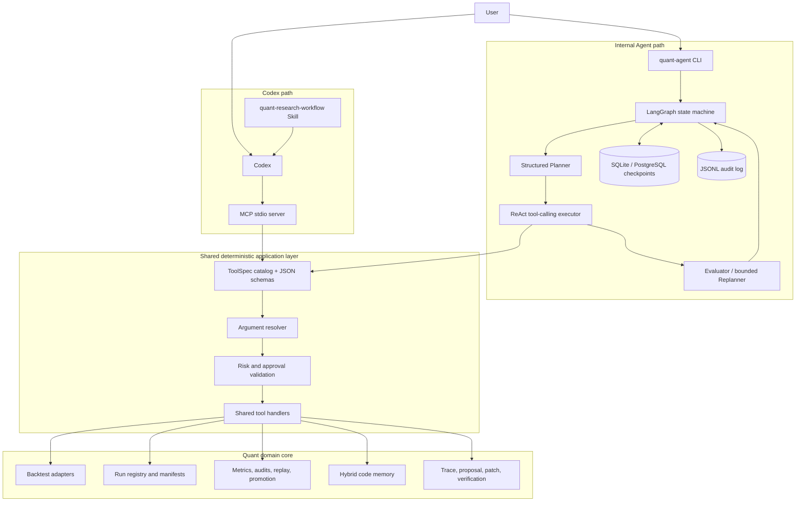

# Quant-Agent: Everything You Need to Know for an Applied LLM Interview

> Verified project snapshot: September 14, 2026  
> Project root: repository root  
> Current version: `0.1.0`  
> Runtime: Python 3.11  
> Status: working domain-agent system and portfolio project; not a production trading platform

## 1. The shortest accurate description

Quant-Agent is an evidence-driven agent for quantitative research operations. It can ingest or launch an external backtest, normalize its outputs, calculate metrics, run deterministic audits, inspect missing artifacts, retrieve relevant source code, prepare a structured repair proposal, pause for human approval, apply a narrowly scoped patch, rerun the backtest, verify the new artifacts, and record the entire process.

It has two ways to orchestrate the same underlying tools:

1. An internal LangGraph agent with persistent state, native tool calling, structured planning, evaluation, bounded replanning, and interrupt/resume approval.
2. A Codex integration where a repository Skill teaches the workflow and an MCP server exposes the same Python tools to Codex.

The central design idea is that the LLM is allowed to reason and choose from registered tools, but it is not trusted to define permissions, bypass approval, edit arbitrary files, or declare success without evidence.

## 2. A 30-second interview pitch

> I built a domain-specific agent for quantitative research operations. It wraps an existing backtest system with a stable artifact model, deterministic audits, a LangGraph plan-and-execute loop, human approval, configurable SQLite/PostgreSQL checkpoints, and hybrid code retrieval. The LLM can create plans, choose tools, and evaluate results, but all actions pass through a deterministic tool registry and safety layer. I also exposed the same tools to Codex through a local MCP server and packaged the workflow as a Codex Skill. The project currently has 145 verified tests when the optional PostgreSQL integration service is enabled, plus a verified end-to-end backtest artifact set.

## 3. A two-minute interview explanation

> The project began as a deterministic CLI around an external quantitative backtest. The first problem was not model intelligence; it was making the research process observable and repeatable. I introduced configuration-driven adapters, normalized run folders, manifests, metrics, position and trade artifacts, and deterministic audit reports.
>
> I then built a shared tool layer. Every action has a JSON schema and a centrally assigned risk level. Both the CLI Agent and the MCP server call the same handlers, so there is no second implementation that can drift from the first.
>
> On top of that, I implemented a LangGraph state machine. The strongest mode first asks an LLM for a structured multi-step plan. A ReAct-style executor then uses native function calling to choose one tool at a time. After meaningful actions, a structured evaluator checks the actual tool result against the current step's success criteria. It can continue, stop, or request a bounded replan. The system rejects attempts to complete a future step or claim completion without a successful matching tool result.
>
> Risky actions use LangGraph `interrupt()` and resume through `Command(resume=...)`, with configurable SQLite or PostgreSQL checkpoints keyed by `thread_id`. SQLite remains the default for local work; the official PostgreSQL saver supports service and multi-process deployment. JSONL remains a separate audit log. For source investigation, I implemented hybrid retrieval using BM25, exact symbol and path matching, optional dense embeddings, and weighted reciprocal-rank fusion. Finally, I exposed the same 15 tools over MCP and wrote a Codex Skill for the inspect–diagnose–propose–approve–execute–verify–report workflow.
>
> I would describe it as a tested, modern Agent prototype with a real quantitative domain core—not as a production trading system or a general coding agent.

## 4. What problem does the project solve?

Quantitative research often produces scripts, CSV files, summary tables, and ad hoc reports, but it does not automatically produce a trustworthy explanation of what happened. Common operational problems include:

- A run completed but a required artifact such as `trades.csv` is missing.
- A report claims one strategy variant while the source code exports another.
- Performance looks strong, but transaction costs, lag safety, robustness, or validation concentration have not been reviewed.
- A repair is proposed without evidence about the relevant code path.
- A model suggests an edit but cannot prove that the patch was applied or that the rerun fixed the problem.
- A long-running Agent stops at an approval boundary and cannot safely resume.

Quant-Agent turns these loosely connected tasks into a repeatable workflow with explicit evidence, state, permissions, and verification.

## 5. What the project is—and is not

### It is

- A functioning quantitative-research audit and repair Agent.
- An installable Python package with a CLI.
- A LangGraph state machine with multiple planning/execution modes.
- A deterministic safety layer around LLM-selected tools.
- A persistent approval workflow using configurable SQLite/PostgreSQL checkpoints.
- A hybrid code-retrieval system with source citations.
- A thin MCP server over a shared tool registry.
- A repository Codex Skill that explains how to use those tools safely.
- A tested integration with a real external XGBoost research repository.

### It is not

- A production order-execution or portfolio-management system.
- A general-purpose replacement for Codex.
- A fully autonomous software engineer with unrestricted shell and file access.
- A complete static-analysis engine or runtime debugger.
- A distributed service with multi-user authentication.
- A scheduled service with alerts, dashboards, or on-call monitoring.
- A public GitHub repository at the time of this snapshot.

## 6. Verified project facts

| Item | Verified state |
|---|---:|
| Python source files | 78 |
| Approximate Python source lines | 12,579 |
| Test files | 34 |
| Approximate test lines | 3,899 |
| Passing tests with PostgreSQL integration enabled | 145 |
| Default suite without PostgreSQL service | 143 passing, 2 deselected |
| End-to-end Agent eval scenarios | 6 passing |
| Recorded project capabilities | 26 implemented, 0 partial, 0 planned |
| MCP tools | 15 |
| Main runtime | Python 3.11.1 in `.venv311` |
| LangGraph version in the verified environment | 1.2.4 |
| MCP SDK version installed in the verified environment | 2.2.0 |
| Git repository | No `.git` directory yet |
| CI workflow | Not implemented |
| Scheduler | Not implemented |
| Active monitoring/alerting | Not implemented |

Line counts are a local snapshot, not a quality metric. The more important evidence is the executable behavior, the test suite, and the saved run artifacts.

## 7. Architecture at a glance

There are two orchestration paths, but only one business-tool implementation.



The important interview point is that MCP does **not** create a second Agent implementation. In the internal path, LangGraph performs orchestration. In the Codex path, Codex performs orchestration using the Skill, while MCP only transports tool definitions and calls. Both paths converge on the same catalog, validation, and handlers.

## 8. Major layers and their responsibilities

### 8.1 Quantitative business core

The lowest layer performs deterministic quantitative work:

- Loads YAML strategy configuration.
- Dispatches to a dummy engine or an external subprocess/CSV adapter.
- Normalizes source outputs into stable project artifacts.
- Calculates and enriches performance metrics.
- Saves manifests and reproducibility information.
- Runs artifact, lag, robustness, validation, cost, documentation, and promotion audits.
- Replays daily decisions using positions, trades, and rankings.

Representative code:

- `src/quant_agent/config.py`
- `src/quant_agent/backtest/adapter.py`
- `src/quant_agent/backtest/subprocess_csv_engine.py`
- `src/quant_agent/registry.py`
- `src/quant_agent/metrics.py`
- `src/quant_agent/audits/`
- `src/quant_agent/replay/`

This layer does not need an LLM. Its outputs should be reproducible for the same inputs.

### 8.2 Run registry and artifact model

Each experiment becomes a durable run directory rather than a transient console result. A run may contain:

```text
runs/<run_id>/
├── manifest.json
├── engine_metadata.json
├── config.yaml
├── metrics.json
├── flags.json
├── decision_log.csv
├── equity_curve.csv
├── positions.csv
├── trades.csv
├── source_artifacts/
├── report.md
└── audits/
```

The run registry is important because the Agent needs concrete evidence. It should not reason from vague conversation memory when it can read a saved manifest, metric, audit, or artifact.

### 8.3 Audit and promotion layer

The project performs multiple deterministic checks:

| Audit | Purpose |
|---|---|
| Artifact contract | Verify required files, columns, and minimum row counts. |
| Lag safety | Check that data availability does not occur after the decision or execution date. |
| Robustness | Compare nearby variants, rolling behavior, drawdown, and window sensitivity. |
| Validation attribution | Explain validation performance by days, states, exposure, and year. |
| Cost/slippage stress | Recalculate performance under higher transaction-cost assumptions. |
| Documentation consistency | Check whether documents agree with recorded run metadata and artifacts. |
| Promotion audit | Combine metrics, flags, artifacts, lag, robustness, cost, lineage, and diagnosis into a recommendation. |
| Promotion closure | Classify warnings as closed, requiring action, requiring a human decision, or blocked. |

The Agent is therefore not simply asking an LLM, “Does this strategy look good?” It first creates deterministic evidence, then optionally asks an LLM to interpret that evidence.

### 8.4 Shared tool layer

`src/quant_agent/agent/tool_catalog.py` defines the canonical `ToolSpec` objects. Each tool records:

- Name.
- Human-readable description.
- JSON input schema.
- Risk class: `safe` or `approval_gated`.
- MCP behavior metadata: read-only, destructive, and open-world hints.

`src/quant_agent/agent/tools.py` contains the shared handlers. `invoke_tool()` constructs an `AgentAction`, resolves its arguments, validates permission, and dispatches through the handler registry.

This gives the project a single contract used by:

- The rule planner.
- The legacy JSON LLM selector.
- The ReAct executor.
- The structured planner's allowed tool list.
- The MCP server.

This is one of the strongest architectural decisions in the project because it prevents different interfaces from silently developing different safety or business behavior.

## 9. The 15 shared Agent/MCP tools

### Read-only evidence tools

| Tool | Purpose |
|---|---|
| `read_project_state` | Read the central implementation status, gaps, latest run, and next steps. |
| `read_capabilities` | Read the command/capability inventory. |
| `inspect_latest_run` | Read the latest run's manifest, metadata, compact metrics, artifact status, and promotion status. |
| `metrics_latest` | Read compact metrics for the latest run. |
| `inspect_proposal` | Summarize a proposal and its patch/application status. |
| `query_code_memory` | Retrieve cited code chunks using hybrid semantic, lexical, symbol, and path search. |

`query_code_memory` is read-only with respect to the project, but it is marked open-world because semantic query embedding may contact the configured provider.

### Evidence-generating write tools

| Tool | Purpose |
|---|---|
| `inspect_artifacts_latest` | Recompute and save the artifact-contract audit. |
| `promote_latest` | Recompute and save the promotion audit. |
| `suggest_revision` | Save a structured revision plan after failed verification. |
| `synthesize_revision` | Convert a supported revision case into a new proposal. |

These are low-risk domain writes, but they are not marked read-only in MCP. With the current Codex configuration, write operations can trigger host approval.

### Approval-gated operations

| Tool | Why it is gated |
|---|---|
| `trace_source` | Reads an external repository and writes trace artifacts. |
| `suggest_fix` | Creates a repair proposal and may call an external LLM provider. |
| `apply_fix_dry_run` | Crosses into the patch lifecycle and validates a reviewed proposal. |
| `apply_fix_yes` | Modifies the exact target repository file and is marked destructive. |
| `run_fresh` | Launches the configured external backtest and may be long-running or access external resources. |

The model cannot make a gated tool safe by returning `requires_approval=false`. The application derives risk again from the central catalog.

## 10. The LangGraph Agent

### 10.1 State graph

The graph is defined in `src/quant_agent/agent/graph.py`:

```text
observe -> plan -> decide
                    |
                    +-> approval -> execute -> evaluate -> decide
                    |
                    +-> execute -> evaluate -> decide
                    |
                    +-> end
```

The state is a typed dictionary containing:

- User task and provider settings.
- Session ID and `thread_id`.
- Current status and current action.
- Observations and action records.
- ReAct trace and final message.
- Structured plan, plan version, current step, and plan history.
- Evaluation history and count.
- Replan count and limit.
- Approval request and decision.
- Paths to JSONL, JSON state, and approval record, plus backend-safe checkpoint metadata.
- Errors and final output.

### 10.2 Four planner/executor modes

The CLI preserves four modes so their behavior can be compared:

| Mode | How it works | LLM involvement |
|---|---|---|
| `rule` | Keyword and state-based deterministic routing. | None. |
| `llm` | Legacy structured JSON next-action selector. | One LLM selection per decision. |
| `react` | Native provider function/tool calling, one tool per model turn. | LLM chooses each next tool or finishes. |
| `plan-react` | Structured plan in State, ReAct execution, evaluator after each meaningful action, bounded replanning. | LLM plans, chooses tools, evaluates, and optionally replans. |

`plan-react` is the strongest and most interview-relevant mode. The older modes remain valuable as deterministic baselines and compatibility paths.

## 11. Where exactly does the LLM participate?

This distinction matters because not every Agent step should be an LLM call.

| Function | Technique | LLM required? |
|---|---|---:|
| Load project/run state | JSON and CSV parsing | No |
| Compute metrics and audits | Deterministic Python | No |
| Route simple CLI requests | Keyword/rule router | No |
| Create a multi-step plan in `plan-react` | Structured model output constrained by JSON schema | Yes |
| Select the next tool in ReAct | Native function/tool calling | Yes |
| Execute a tool | Registered Python handler | No |
| Decide whether approval is required | Central risk policy | No |
| Pause and resume | LangGraph checkpoint and interrupt | No |
| Evaluate current plan-step evidence | Structured model output plus deterministic validation | Yes |
| Replan remaining work | Structured model output, capped by `max_replans` | Yes |
| Trace a supported source file | Static syntax/regex source inspection | No |
| Retrieve likely source code | BM25/symbol/path and optional embeddings | Embeddings are optional; ranking itself is deterministic |
| Draft an unfamiliar generalized repair | Review-only LLM synthesis | Yes |
| Apply a patch | Deterministic unified-diff parser and path checks | No |
| Verify new artifacts | Backtest plus deterministic audits | No |

The planner is a **role in the system**. The LLM is one possible engine used to perform that role. The deterministic rule planner proves that “planner” and “LLM” are not synonyms.

## 12. Structured planning, evaluation, and replanning

### 12.1 Planner

The structured planner must return an object with:

- A goal.
- An ordered step list.
- A title and description for every step.
- One or more allowed tools for every step.
- Concrete success criteria.

The application rejects:

- Empty plans.
- Plans that exceed the remaining action budget.
- Unknown tools.
- Attempts to include automatic preflight tools.
- Structurally invalid fields.

The normalized plan is stored in LangGraph State with versioned step IDs such as `v1_step_1`.

### 12.2 ReAct executor

For the current plan step, the executor exposes only that step's tools to the provider. It permits at most one tool call per model turn. After execution, the result is returned to the provider using the matching tool-call ID.

This is more than a prompt that asks the model to “think step by step.” It is an actual loop:

```text
model tool call -> deterministic execution -> correlated tool result -> next model turn
```

### 12.3 Evaluator

After a meaningful non-preflight tool call, the evaluator receives:

- The task.
- Current plan and current step.
- Actual last action and result.
- Evaluation and replan budgets.

The model can return `continue`, `replan`, `complete`, or `blocked`, but deterministic code checks the claim. In particular:

- It can only mark the current step complete.
- The last action must have succeeded.
- The action must be one of the current step's allowed tools.
- The session cannot be completed while plan steps remain.

This is a concrete example of combining probabilistic reasoning with deterministic invariants.

### 12.4 Bounded replanner

If evidence invalidates the remaining plan, the replanner creates only the unfinished steps. Completed steps are preserved. Replanning is capped by `max_replans`, and evaluator calls are capped by the session action budget. Exhausting a limit blocks the Agent instead of allowing an infinite loop.

## 13. Persistence and human approval

### 13.1 What is persisted?

```text
state/sessions/<session_id>.jsonl          Human-readable event audit log
state/sessions/<session_id>.state.json     Human-readable latest state snapshot
state/sessions/<session_id>.approval.json  Current approval request and decision
state/sessions/checkpoints.sqlite          Default local LangGraph checkpoint store
PostgreSQL official checkpoint tables      Optional service/multi-process store
```

`src/quant_agent/agent/persistence.py` owns backend selection and lifecycle.
The runner asks this factory for a checkpointer; the graph and quant business
tools do not contain PostgreSQL-specific logic. Selection comes from
`--checkpoint-backend`, `QUANT_AGENT_CHECKPOINT_BACKEND`, and
`QUANT_AGENT_CHECKPOINT_POSTGRES_URI`. SQLite remains the zero-configuration
default. The PostgreSQL package is an optional install extra, so ordinary local
development does not require a database.

### 13.2 How pause/resume works

When a gated action is selected:

1. The Agent writes an approval request containing the task, action, arguments, rationale, session, and resume commands.
2. The LangGraph approval node calls `interrupt(approval)`.
3. The selected SQLite or PostgreSQL checkpointer stores graph state under `thread_id`.
4. The process exits in `waiting_approval` status.
5. The user runs `agent-resume --approve` or `agent-resume --reject`.
6. The runner reloads the checkpoint and calls `Command(resume={"decision": ...})`.
7. Approved execution still goes through the same deterministic validation and handler registry.

The selected LangGraph checkpointer is the execution source of truth. JSON state
is for inspection, and JSONL is an append-only audit trail. PostgreSQL connection
URIs are intentionally excluded from both state and audit files.

The integration test starts a session in one Python process, reaches a real
LangGraph interrupt, closes that process, verifies the pending checkpoint through
a fresh checkpointer, deletes the readable JSON state snapshot, and resumes the
same `thread_id` in a second Python process. The same parameterized scenario runs
against SQLite and PostgreSQL. Its reject branch proves the gated action never
executes; its approve branch proves it executes exactly once.

### 13.3 What persistence does not yet guarantee

The public resume command is designed around pending approvals. PostgreSQL makes
checkpoints accessible to multiple application processes, but it does not make
arbitrary side effects exactly-once. The project does not yet provide a general
job supervisor that automatically restarts any arbitrary process crash, retries
transient provider failures with exponential backoff, or resumes an interrupted
external backtest from its internal midpoint.

The accurate interview claim is **persistent Agent execution and approval resume**, not complete production-grade disaster recovery.

## 14. Deterministic safety architecture

The safety model has several layers:

1. **Allowlisted tools:** the model can select only tools in `TOOL_SPECS`.
2. **Central risk ownership:** risk is defined in code, not accepted from model output.
3. **Blocked generic actions:** unrestricted external editing and package installation are explicitly blocked in the internal Agent.
4. **Schema validation:** plans, evaluations, and tool arguments have defined structures.
5. **Action-budget limits:** sessions stop at `max_steps`.
6. **Replan/evaluation limits:** self-correction cannot loop forever.
7. **Human approval:** risky transitions pause before execution.
8. **Path containment:** patch targets must remain inside the proposal's repository.
9. **Patch context checking:** the unified-diff applier checks expected source lines.
10. **Proposal quality gate:** a repair package must include the problem, targets, intended behavior, patch plan, verification, and evidence.
11. **Evidence-checked completion:** the evaluator cannot complete a step without a successful matching tool result.
12. **Revision-loop guard:** repeated proposal or failure signatures block the lifecycle.

This is the project's “deterministic safety layer.” It does not mean the entire Agent is deterministic. It means that permissions and critical invariants are deterministic even when reasoning is probabilistic.

## 15. Code memory and hybrid retrieval

### 15.1 Why retrieval exists

A search for “where are trades exported?” should not be a random guess by the LLM. The system first retrieves likely evidence and gives the Agent cited chunks.

### 15.2 Index construction

The local index stores source chunks with:

- Relative path.
- Start and end line.
- Source excerpt.
- Token frequencies.
- Extracted Python functions/classes.
- A compact deterministic hashed sparse vector.
- An optional dense OpenAI embedding.

The default index is local and does not require an external vector database.

### 15.3 Query ranking

The hybrid ranker combines:

- BM25 lexical relevance.
- Exact symbol overlap.
- Path-token overlap.
- Optional dense-embedding cosine similarity.
- Hashed sparse-vector similarity when dense embeddings are unavailable.
- A small implementation-file boost.

Channel rankings are fused with weighted reciprocal-rank fusion. Current weights are:

```text
semantic:       1.00
BM25 lexical:   1.00
symbol:         0.70
path:           0.45
hashed fallback:0.40
```

Every result includes component scores and a citation such as:

```text
research/run_strategy.py:210-289
```

### 15.4 Failure behavior

- If no semantic index exists, retrieval remains usable through lexical/symbol/path channels.
- In automatic mode, a missing key or failed embedding request falls back visibly to local retrieval.
- In explicit OpenAI mode, provider failure is surfaced rather than silently presented as semantic success.
- Version-1 indexes remain readable, but must be rebuilt to gain dense embeddings.

### 15.5 What “trace” means in this project

`trace_source` performs a deterministic **static source trace**. It inspects functions, calls, imports, CSV exports, and likely weight/ranking variables to identify where a missing artifact should be produced.

It is not a full runtime trace, compiler-grade interprocedural call graph, symbolic executor, or whole-program dataflow analysis. It is a targeted domain heuristic that becomes more reliable because retrieval first narrows the likely file and the output includes reviewable evidence.

## 16. Repair proposal and verification lifecycle

The intended workflow is:

```text
inspect run
-> detect missing or inconsistent evidence
-> retrieve relevant code
-> trace likely source path
-> create structured proposal
-> inspect proposal
-> request dry-run approval
-> dry-run patch
-> request application approval
-> apply exact patch
-> request fresh-run approval
-> rerun external backtest
-> inspect artifacts and metrics
-> report success or create a revision
```

### 16.1 Supported deterministic repairs

The project has known repair generators for:

- Missing position/trade/ranking exports.
- Stale strategy metadata.

For recognized safe source shapes, the proposal may contain an auto-applicable unified diff.

### 16.2 Generalized repair

For unfamiliar source shapes, an LLM can draft:

- Problem summary.
- Intended behavior.
- Patch plan.
- Verification commands.
- Optional candidate patch.

These generalized proposals remain review-only with `apply_supported=false`. This avoids treating unfamiliar model-generated code as automatically safe.

### 16.3 Failure and revision

If a fresh run fails or the artifact contract remains unsatisfied, the lifecycle saves failure context and creates a revision proposal. Automatic revision synthesis is currently limited to missing position/trade/ranking export failures. Repeated synthesized proposals or repeated failure signatures trigger a loop guard.

## 17. External backtest integration

The real integration target is an XGBoost quantitative-research repository at:

```text
C:/path/to/xgboost
```

The Agent runtime and research runtime are intentionally separated:

```text
Quant-Agent: Python 3.11
External XGBoost research script: Python 3.7 subprocess
```

The adapter can either:

- Read existing configured outputs without launching the expensive backtest.
- Launch a fresh configured subprocess and ingest its outputs afterward.

This boundary was chosen because the research script has fixed paths, global state, monkeypatches, and side effects. Importing it directly into the Agent process would create dependency and state contamination. A subprocess adapter provides process isolation while the YAML configuration makes inputs and expected outputs explicit.

The current live configuration expects summary, daily curve, positions, trades, rankings, metadata, rolling-window, bucket, changed-day, variant-specification, and report artifacts.

## 18. Verified latest run

| Field | Value |
|---|---|
| Run ID | `base5_combo_accel2_mom12_20260609_002` |
| Engine | `subprocess_csv` |
| Expected variant | `base5_combo_accel2_mom12` |
| Primary window | `full_2000_2026` |
| Fresh subprocess executed | Yes |
| Exit code | 0 |
| Elapsed time | 692.926 seconds (about 11.6 minutes) |
| Artifact contract | `satisfied` |
| Promotion recommendation | `review_required` |

### Metrics

| Metric | Value |
|---|---:|
| CAGR | 27.47% |
| Maximum drawdown | -34.68% |
| Calmar ratio | 0.792 |
| Sharpe ratio | 0.990 |
| Turnover per year | 48.84 |
| Exposure | 72.51% |

These metrics describe the saved research run. They are not a claim of live future performance.

### Position-level artifacts

| Artifact | Rows |
|---|---:|
| `positions.csv` | 33,359 |
| `trades.csv` | 17,317 |
| rankings | 31,025 |

### Promotion state

There are no blocking promotion failures, but the recommendation remains `review_required`. The current warnings are:

- `source_current_variant_is_control`
- `upstream_flags_present`
- `validation_cagr_outperformance`
- `cost_stress_review_required`
- `robustness_review_required`

The promotion-closure report closed the first warning and classified the remaining four as requiring human decisions. This is the correct behavior: an Agent architecture should not silently turn strategy-governance judgment into an automated approval.

## 19. LLM provider architecture

The provider interface supports:

- Mock provider for deterministic offline tests.
- OpenAI Responses API.
- DeepSeek Chat Completions API.

### OpenAI path

The OpenAI adapter uses:

- Responses API function tools for ReAct selection.
- `parallel_tool_calls=false` so the Agent executes one tool per turn.
- Correlated `function_call` and `function_call_output` items.
- Strict JSON Schema output for planner, evaluator, and replanner objects.

### DeepSeek path

The DeepSeek adapter uses:

- Chat Completions tool calls for ReAct selection.
- A one-tool-per-turn validation rule.
- JSON-object mode for structured planning outputs.
- Local parsing and normalization to enforce the expected schema and invariants.

### Mock path

The mock provider is not pretending to evaluate model quality. Its purpose is to make orchestration, persistence, safety, and lifecycle tests deterministic and free of API cost.

## 20. MCP implementation

### 20.1 Why MCP was added

The internal Agent is useful for demonstrating orchestration, but a real developer may prefer using Codex as the outer Agent. MCP allows the project to expose its domain tools without rebuilding Codex.

The official OpenAI documentation describes local stdio MCP servers as processes started by a command and supports shared MCP configuration across the Codex app, CLI, and IDE. It also recommends accurate tool schemas and annotations. See [Codex MCP documentation](https://developers.openai.com/codex/mcp) and [OpenAI MCP server guidance](https://developers.openai.com/plugins/build/mcp-server).

### 20.2 How the server works

`src/quant_agent/mcp_server.py`:

- Uses the official MCP Python SDK.
- Serves through standard input/output.
- Converts every central `ToolSpec` into an MCP `Tool`.
- Publishes the existing JSON input schema.
- Returns structured JSON content.
- Publishes read-only, destructive, idempotent, and open-world annotations.
- Delegates all calls to `invoke_tool()`.
- Runs synchronous domain work in a worker thread so the protocol loop is not blocked.
- Returns sanitized structured errors instead of protocol-breaking tracebacks.
- Disables approval-gated tools unless the server is explicitly started with `--enable-approval-gated`.

### 20.3 Codex configuration

The public repository contains `.codex/config.example.toml`. Each developer copies it to the ignored `.codex/config.toml` and supplies local paths. A global `quant_agent` registration is also supported. The active configuration:

- Launches the Python 3.11 MCP module.
- Sets the Agent project root.
- Enables approval-gated tools at deployment level.
- Uses `default_tools_approval_mode = "writes"` so Codex prompts for writes.
- Forwards configured OpenAI and DeepSeek key variables without storing their values in the project configuration.

After restarting Codex, the server was verified from a live Codex session. Codex discovered all 15 tools, and real MCP calls to `read_project_state` and `read_capabilities` returned the correct current project state.

### 20.4 MCP safety boundary

MCP annotations are descriptive hints to the host; they are not treated as the only security control. The deployment flag, Codex host approval, central catalog, argument resolver, path checks, proposal checks, and deterministic handlers remain separate layers.

## 21. Codex Skill implementation

The Skill is located at:

```text
.agents/skills/quant-research-workflow/
├── SKILL.md
├── agents/openai.yaml
└── references/tool-guide.md
```

The Skill teaches Codex to:

1. Read project state and capability evidence.
2. Inspect only the relevant run, metrics, artifacts, and promotion evidence.
3. Retrieve cited source context before broad trace/fix work.
4. Create and inspect a proposal before application.
5. Obtain separate approval for dry-run, application, and fresh rerun.
6. Verify with artifacts and metrics.
7. Report actions, approvals, evidence, and unresolved risk.

The Skill does not execute code and does not grant permission. It is workflow knowledge; MCP is the tool transport; Python code is the enforcement and business layer.

The Skill follows the repository-local layout described by the [official Codex Skills documentation](https://developers.openai.com/codex/skills).

## 22. Testing strategy

The current test suite contains 145 passing tests across 35 files when the
optional PostgreSQL integration database is enabled. Without that service, the
ordinary suite passes 143 tests and deselects the two PostgreSQL cases.

### Major tested areas

- YAML configuration and engine dispatch.
- External subprocess/CSV normalization.
- Run registry, manifests, and metrics.
- Artifact, lag, robustness, validation, cost, and promotion audits.
- Replay using positions, trades, and rankings.
- OpenAI, DeepSeek, and mock provider adapters.
- Discovery, source trace, code memory, and hybrid retrieval.
- Structured fix proposals and patch application.
- Natural-language command routing.
- Tool-risk validation and argument resolution.
- LangGraph session behavior.
- SQLite/PostgreSQL backend parity for state, `thread_id`, pending interrupts, rejection, approval, and exactly-once execution within the tested resume transition.
- Independent-process PostgreSQL checkpoint and approval resume.
- ReAct tool-call/result correlation.
- Structured plans, evaluation, replanning, and limit exhaustion.
- Revision proposal generation and loop guards.
- MCP schema mapping, annotations, disabled gated tools, shared-handler delegation, in-process protocol calls, and real stdio handshake.

### Representative high-value tests

The suite explicitly checks that:

- A plan is persisted and each step is evaluated.
- Replanning modifies remaining work while preserving completed work.
- Replan-limit exhaustion blocks the Agent.
- An evaluator cannot complete a future or unmatched step.
- A structured plan survives an approval interrupt and resume.
- A disabled approval-gated MCP tool returns a protocol-level error.
- MCP calls still go through the shared tool registry.
- A real MCP stdio subprocess can handshake, list tools, and execute a safe call.

### What testing does not yet prove

The 145 tests remain primarily unit and integration tests, so they are complemented by a separate six-scenario end-to-end suite under `evals/`. The scenarios use isolated copies/fixtures and deterministic contracts to check complete task behavior: read-only assessment, approval rejection, successful repair, failed-verification replanning, loop protection, and MCP parity. The runner records pass/fail, task success, graph status, terminal reason, selected/executed tool sequences, approval compliance, unauthorized-action violations, steps, mutations, latency, and evidence in JSON plus Markdown.

Most graders are deterministic: ordered subsequences rather than brittle exact traces, forbidden tools, approval records, byte/file hashes, artifact contracts, checkpoint interrupts, failure evidence, loop counts, and MCP schema/result equality. A deterministic fake embedding probe verifies semantic retrieval for a low-lexical-overlap query. What remains unproven is broad behavior across many prompts and real model versions; the real-provider smoke path is deliberately optional rather than part of the free repeatable default.

## 23. Scheduling, persistence, exception recovery, and monitoring

These terms are often confused in interviews. The accurate status is:

| Area | Status | What exists | What is missing |
|---|---|---|---|
| Scheduled running | Not implemented | Manual/configured `run_fresh` and subprocess timeout | Cron/task scheduler, recurring job state, missed-run handling |
| Persistence | Implemented | Run artifacts, manifests, project state, proposal files, JSONL logs, configurable SQLite/PostgreSQL graph checkpoints | Multi-tenant state service, retention policy, and database operations automation |
| Approval recovery | Implemented | `interrupt()` plus `Command(resume=...)` from either checkpoint backend, including verified cross-process PostgreSQL resume | Rich in-app approval UI for standalone CLI mode |
| Failure handling | Partial | Structured errors, blocked states, audit logs, provider fallback in auto retrieval, loop guards | General retry/backoff, arbitrary crash resume, dead-letter queue, distributed job recovery |
| Monitoring | Not implemented as a service | Inspectable artifacts, audit reports, session logs | Metrics exporter, dashboard, alerting, health checks, on-call workflow |

Do not describe saved audit files as “production monitoring.” They provide observability evidence, but there is no continuous monitoring service.

## 24. Important design decisions and tradeoffs

### Preserve the deterministic quant core

The project did not replace working quantitative code with an LLM. Deterministic calculations, audits, patch checks, and artifact validation remain deterministic. This reduces regression risk and makes Agent behavior easier to evaluate.

### Use a subprocess boundary for the legacy research repository

This avoids Python-version conflicts and isolates global state and side effects. The cost is configuration-specific integration and less direct introspection.

### Use a central tool catalog

This prevents CLI, LangGraph, provider, and MCP definitions from drifting. The cost is that every new capability must be deliberately registered and assigned a risk class.

### Use LangGraph checkpointing instead of custom resume logic

Native graph checkpoints preserve execution position and state around interrupts. JSONL is retained separately because checkpoints are efficient for execution but less convenient for human audit.

### Combine structured planning with ReAct

A plan gives global direction; ReAct adapts one tool at a time. The evaluator closes the loop using actual results. The cost is additional LLM calls and orchestration complexity.

### Bound evaluation and replanning

Self-correction is useful only if it cannot loop indefinitely. Hard limits make cost and failure behavior understandable.

### Use hybrid retrieval instead of vector-only search

Code contains exact symbols, paths, and identifiers that lexical search handles well. Semantic search helps when the question uses different wording. Weighted fusion retains both strengths and provides a local fallback.

### Keep MCP thin

MCP is an adapter, not a second domain layer. This makes the integration easier to test and avoids duplicating business rules.

### Keep the Skill separate from safety enforcement

Prompts and Skills guide model behavior but can be misunderstood. Authorization and path checks belong in deterministic code and the host approval system.

## 25. How technically deep is the project?

The project is deeper than a prompt wrapper because it implements:

- Stateful graph orchestration.
- Native provider tool calling and correlated results.
- Strict structured planning outputs.
- Deterministic validation of model evaluation claims.
- Persistent human-in-the-loop execution.
- Domain-specific tool contracts and risk policy.
- Hybrid retrieval with multiple ranking channels and citations.
- Structured repair proposals and guarded patch application.
- MCP transport and Codex Skill integration.
- Real external-process and artifact integration.
- Broad unit/integration testing.

It is not yet at production-platform depth because it lacks:

- Multi-user service boundaries.
- Authentication and tenancy.
- Distributed execution.
- Scheduler and job queue.
- Operational telemetry and alerts.
- CI/CD and packaged deployment.
- Broad empirical Agent evaluations.

A fair description is: **a substantial personal Applied LLM systems project with real Agent-engineering depth and a deliberately limited domain**, not a toy prompt demo and not a production platform.

## 26. What was learned through the project

The strongest learning outcomes are:

1. Agent quality depends on tool and state design, not just prompting.
2. “Planner,” “LLM,” “tool,” and “workflow” are different concepts.
3. A model should propose and interpret; deterministic code should enforce critical invariants.
4. Persistence is more than saving chat history—it must preserve executable state and the exact interrupt location.
5. Evaluation requires checking model claims against external evidence.
6. Code retrieval works better when semantic similarity is combined with symbols, paths, and lexical relevance.
7. Human approval should be attached to concrete actions and arguments, not a vague blanket permission.
8. MCP is most valuable when a stable domain tool layer already exists.
9. A Skill should explain how to combine tools; it should not duplicate the tool implementation.
10. Honest scope boundaries make a portfolio project more credible.

## 27. Interview questions and strong answers

### “Is this just a toy Agent?”

> It is a personal prototype rather than a production service, but it is not only a prompt demo. It operates on a real external backtest, writes and validates durable artifacts, persists graph execution in SQLite or PostgreSQL, enforces approval and path rules outside the model, retrieves cited code, applies reviewed patches, has 145 verified unit/integration tests with PostgreSQL enabled, and passes six isolated end-to-end Agent scenarios. The missing production pieces are scheduling, monitoring, multi-user security, CI/CD, and broad real-provider evaluation.

### “Where is the LLM actually used?”

> In the strongest mode, the LLM produces a structured plan, chooses one function tool per ReAct turn, evaluates evidence for the current step, and can replan the unfinished work. It is also used for one-shot diagnosis and review-only generalized repair drafting. Metrics, audits, permissions, path checks, patch application, persistence, and verification are deterministic.

### “Why use LangGraph?”

> I needed explicit state transitions, conditional routing, a human interrupt point, and checkpointed resume. LangGraph provides those primitives, while I keep the business handlers framework-independent so they can also be called from the CLI or MCP.

### “What prevents the model from bypassing approval?”

> The model does not own the risk field. The central catalog assigns each tool's risk. After the model returns a tool call, deterministic code reloads the specification, verifies the action, and interrupts before a gated call. The MCP route also uses host approval for writes. Patch paths and proposal contents are validated again during execution.

### “How is your Planner different from your earlier next-action selector?”

> The selector returned only the next action. The current structured Planner produces an ordered, schema-validated plan with per-step tools and success criteria, stores it in State, versions it, and supports bounded replanning of only unfinished work. The next-action executor then operates inside the current plan step.

### “How does the Evaluator avoid hallucinating success?”

> The evaluator can express a verdict, but deterministic code checks its completed step IDs against the current step and verifies that the last action succeeded and used an allowed tool. It cannot skip ahead or finish the session while steps remain.

### “What does your source trace do?”

> It is a targeted static trace using syntax and regex-based inspection of functions, calls, imports, exports, and domain variables. Retrieval first narrows the evidence. I would not call it a compiler-grade call graph or runtime trace.

### “Why not use only embeddings?”

> Exact function names and file paths are high-signal in code. BM25, symbol matching, and path matching handle those cases, while embeddings help semantic phrasing. Reciprocal-rank fusion combines them, and the local channels keep the system usable without an API key.

### “Why not use a vector database?”

> The current repository scale does not require one. A versioned local JSON index is easy to inspect, test, and distribute. A vector database would be justified later for much larger corpora, concurrent users, metadata filters, or frequent incremental updates.

### “How are OpenAI and DeepSeek handled?”

> They implement a shared provider interface. OpenAI uses Responses function tools and strict JSON Schema output. DeepSeek uses Chat Completions tools and JSON-object mode followed by local validation. A deterministic mock provider makes orchestration tests reliable and inexpensive.

### “Why SQLite, PostgreSQL, and JSONL?”

> SQLite and PostgreSQL are interchangeable execution checkpoint backends: SQLite is the zero-configuration local default, while PostgreSQL supports shared service and multi-process deployment. JSONL provides a chronological, human-readable audit record. Checkpoints and audit logs solve different problems.

### “How do you know PostgreSQL resume actually works?”

> I test behavior, not only connectivity. One process starts the Agent and reaches `interrupt()`. The test verifies the pending state in PostgreSQL, deletes the JSON snapshot, and launches a second process with the same `thread_id` and `Command(resume=...)`. Rejection executes nothing; approval executes the gated tool once. The same contract also runs against SQLite.

### “What happens after a failed repair?”

> The Agent records failure context, creates a structured revision proposal, and can synthesize a new proposal for supported missing-export failures. It tracks signatures and blocks repeated failure/proposal loops. General failure recovery beyond supported shapes remains manual.

### “Why add MCP if you already had an Agent?”

> The internal Agent demonstrates orchestration and remains independently runnable. MCP makes the stable domain tools reusable by Codex, which is a stronger general coding Agent. The Skill supplies workflow knowledge. This avoids spending the project entirely on rebuilding a general-purpose Codex clone.

### “What would you build next?”

> The compact six-scenario Agent evaluation suite is complete. Next I would turn those executable examples into a short architecture/demo package and make MCP setup portable for a public GitHub repository. I would add broader real-provider evaluation only where it gives useful signal; production scheduling and monitoring would come only if there were a real operational user.

## 28. STAR-format project story

### Situation

An existing quantitative research workflow produced good strategy outputs but relied on scripts, loosely structured CSVs, and manual inspection. Missing exports and stale metadata could make results difficult to audit or reproduce.

### Task

Build a trustworthy Agent layer that could inspect research state, find relevant source code, propose and apply narrowly scoped repairs, verify the result, and remain safe enough to demonstrate with real project files.

### Action

- Created config-driven adapters and normalized run artifacts.
- Added deterministic metrics, audits, replay, promotion, and state records.
- Centralized tools with JSON schemas and risk metadata.
- Built a LangGraph Agent with native tool calling, structured plans, evaluation, bounded replanning, configurable SQLite/PostgreSQL checkpointing, and human approval.
- Added hybrid source retrieval with BM25, symbols, paths, optional embeddings, reciprocal-rank fusion, and citations.
- Implemented structured repair proposals, guarded patch application, rerun verification, and revision loop guards.
- Exposed the shared tools to Codex through MCP and packaged the workflow as a Skill.
- Added six isolated end-to-end Agent scenarios with deterministic approval, mutation, artifact, replanning, loop-guard, semantic-retrieval, and MCP-parity grading.
- Maintained a 145-test suite across the evolution, including optional real PostgreSQL cross-process interrupt/resume tests and publication-safety checks.

### Result

The system successfully repaired the external strategy export path and produced a verified fresh run containing 33,359 position rows, 17,317 trade rows, and 31,025 ranking rows. The artifact contract is satisfied. Codex now discovers and can call all 15 domain tools. The latest promotion decision remains correctly held for human strategy review rather than being automatically approved.

## 29. Resume bullet options

Use two or three, not all of them.

- Built a Python/LangGraph quantitative-research Agent with structured planning, native tool calling, evidence-checked evaluation, bounded replanning, configurable SQLite/PostgreSQL checkpointing, and human-in-the-loop approval; verified cross-process interrupt/resume and maintained 145 passing tests plus six passing end-to-end Agent eval scenarios.
- Designed a deterministic safety layer for LLM-selected actions using a central JSON-schema tool registry, code-owned risk classification, execution budgets, path containment, guarded unified-diff application, and revision-loop detection.
- Implemented hybrid code retrieval combining optional dense embeddings, BM25, exact symbol/path matching, and weighted reciprocal-rank fusion, returning per-channel scores and file/line citations for source-grounded repair planning.
- Exposed 15 shared domain tools to Codex through an MCP stdio server and authored a repository Skill for an inspect–diagnose–propose–approve–execute–verify–report workflow without duplicating business logic.
- Integrated a legacy Python 3.7 XGBoost research workflow with a Python 3.11 Agent through a configuration-driven subprocess/CSV boundary, normalized reproducibility artifacts, and deterministic validation and promotion audits.
- Built a guarded repair lifecycle that traces missing exports, generates reviewable proposals, pauses for separate approvals, applies validated patches, reruns an external backtest, and verifies positions, trades, and ranking artifacts.

## 30. Suggested LinkedIn or portfolio description

> Quant-Agent is a domain-specific Applied LLM system for quantitative research operations. It combines a deterministic experiment/audit core with a LangGraph Agent that supports structured multi-step planning, ReAct tool calling, evidence-based evaluation, bounded replanning, configurable SQLite/PostgreSQL checkpoint persistence, persistent human approval, and hybrid source-code retrieval. A shared JSON-schema tool registry powers the CLI, internal Agent, and a local MCP server, while a Codex Skill describes the complete repair and verification workflow. The project currently includes 145 verified tests with PostgreSQL enabled, six passing end-to-end Agent scenarios, and a verified integration with an external XGBoost backtest repository.

## 31. Five-minute demo plan

### Minute 0–1: Explain the architecture

Show the two orchestration paths and emphasize the shared deterministic tool layer.

### Minute 1–2: Inspect without risk

From Codex, ask:

```text
Use the quant research workflow to inspect the current project, latest run,
artifact status, and promotion status. Do not modify anything.
```

Show that Codex calls MCP tools and returns saved evidence rather than inventing an answer.

### Minute 2–3: Show planning and persistence

Run a mock-backed `plan-react` session and show:

- Structured plan in State.
- Tool-call/result trace.
- Evaluation history.
- JSONL audit events.
- Checkpoint backend metadata and a persisted `thread_id` (SQLite by default; PostgreSQL as the service-mode demo).

### Minute 3–4: Show approval

Use a safe fixture/copy of a proposal. Demonstrate that the session pauses at the dry-run or patch boundary and that rejection performs no edit. Then show approval resume.

### Minute 4–5: Show verification

Show the latest verified artifact counts and promotion result. Finish by explaining why `review_required` is a correct result rather than a system failure.

Do not run the full 11.6-minute external backtest live during a short interview. Use a recorded run and test fixture, then explain that a real fresh run has already been verified.

## 32. What to show in the repository

Recommended reading order for an interviewer:

1. `README.md` — usage and feature overview.
2. `INTERVIEW_GUIDE.md` — architecture and honest scope.
3. `src/quant_agent/agent/tool_catalog.py` — shared contracts and risk metadata.
4. `src/quant_agent/agent/graph.py` — graph structure.
5. `src/quant_agent/agent/planning.py` — structured plan/evaluation schemas and deterministic checks.
6. `src/quant_agent/agent/react.py` — native tool-calling loop and result correlation.
7. `src/quant_agent/agent/runner.py` — checkpointing, `thread_id`, and resume.
8. `src/quant_agent/agent/actions.py` — deterministic permissions.
9. `src/quant_agent/memory/hybrid.py` — ranking and fusion.
10. `src/quant_agent/fixes/apply.py` — guarded patch application.
11. `src/quant_agent/mcp_server.py` — thin MCP adapter.
12. `.agents/skills/quant-research-workflow/SKILL.md` — Codex workflow guidance.
13. `tests/test_structured_planning.py` — planner/evaluator/replanner tests.
14. `tests/test_mcp_server.py` — protocol and safety integration tests.
15. `state/project_state.json` — current machine-readable project status.

## 33. Honest limitations to state proactively

1. There is no public GitHub repository yet.
2. Local MCP paths are machine-specific and need a setup helper or template before publication.
3. There is no CI pipeline.
4. There is no scheduler, queue, daemon, or recurring-run controller.
5. There is no active monitoring dashboard or alerting.
6. General automatic crash recovery and retry/backoff are not implemented.
7. Standalone CLI approval is command-based; Codex MCP uses host-native write prompts.
8. Semantic indexing depends on an external OpenAI embedding provider; no local neural embedding backend is packaged.
9. Automatic revision synthesis supports a limited family of missing-export failures.
10. Source trace is targeted static inspection, not complete program analysis.
11. End-to-end coverage uses deterministic mock/scripted providers by default; broad multi-provider benchmarking is not implemented.
12. The external adapter requires explicit configuration for new backtest output shapes.
13. There is no live brokerage execution in this project.
14. Promotion still requires human strategy-risk decisions.

These limitations make the claims credible. They also provide a clear roadmap without implying that every production feature belongs in a personal project.

## 34. Best next step

The six-scenario end-to-end Agent evaluation suite is complete and repeatable. It now provides executable evidence for read-only behavior, rejection safety, successful repair, failed-verification replanning, loop protection, semantic retrieval, and MCP parity.

The best next step is packaging rather than more architecture: create a concise architecture diagram, record a five-minute demonstration using two or three representative scenarios, replace machine-specific MCP paths with a setup helper/template, and prepare a public GitHub repository. Add a small real-provider smoke sample only if it improves the story; keep the deterministic suite as the regression baseline.

## 35. Glossary

**Agent**  
A system where a model can observe state, choose actions, use tools, receive results, and continue until a terminal condition.

**Planner**  
The component or role that creates an action sequence. It may be deterministic or LLM-based.

**ReAct**  
An iterative pattern where the model reasons from current evidence, chooses a tool action, receives the result, and decides again.

**Structured output**  
Model output constrained to a known JSON shape so the application can validate and use it reliably.

**Tool calling**  
A provider feature where the model returns a named function and structured arguments instead of pretending that the action already occurred.

**Deterministic safety layer**  
Normal code that owns permissions, limits, schemas, path rules, and execution checks independently of the model.

**Checkpoint**  
A durable snapshot of graph execution state that can be loaded later.

**`thread_id`**  
The identifier LangGraph uses to associate invocations with the correct checkpointed execution thread.

**Interrupt/resume**  
A pause in graph execution that waits for external input, then continues from the saved position.

**Evaluator**  
The component that judges whether actual tool evidence satisfies the current plan step.

**Replanner**  
The component that revises unfinished work after new evidence invalidates the current plan.

**BM25**  
A lexical ranking method that scores query terms while considering term rarity and document length.

**Embedding**  
A dense numeric representation used to compare semantic similarity between text or code and a query.

**Reciprocal-rank fusion**  
A method that combines several ranked result lists based on rank position rather than requiring directly comparable raw scores.

**MCP**  
Model Context Protocol, used here to expose the local domain tools to Codex through a standard stdio server.

**Skill**  
Repository instructions that teach Codex when and how to combine tools for a repeatable workflow.

**Artifact contract**  
The expected files, columns, and minimum data requirements for a usable research run.

**Promotion audit**  
A consolidated decision report that determines whether research evidence is sufficient for further review or promotion.

## 36. Final positioning

The strongest way to present this project is:

> I did not try to build another unrestricted general coding Agent. I built a domain Agent around a real quantitative workflow, preserved deterministic business logic, and focused the LLM on the parts where probabilistic reasoning adds value: planning, tool selection, interpretation, and bounded self-correction. I then made the same capabilities reusable by Codex through MCP and a Skill. The result is a tested Applied LLM system with explicit state, evidence, permissions, persistence, and honest operational boundaries.

That framing is accurate, technically substantive, and aligned with Applied LLM engineering interviews.
